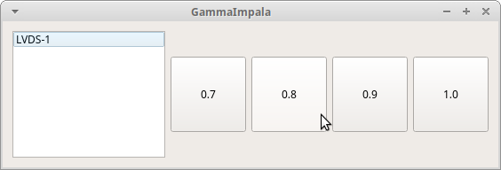

GammaImpala
===========
Change display gamma with one click
-----------------------------------

2019 Gideon van der Kolf, noedigcode@gmail.com



Due to popular demand, the most anticipated Linux utility is finally here!

GammaImpala simply displays a simple GUI with a few buttons to easily change
the gamma settings of all your displays. In addition, command-line usage is
also available so you can bind it to global hotkeys of your desktop environment
to even more instantly serve your gamma needs.

This is the biggest leap in gamma experimentation since the mysterious accidents
that led to the Incredible Hulk. While all care has been taken to provide an
error free application, I do not accept any responsibility for any accidents.
Use this at your own risk.

Requirements:
-------------
* Qt 5
* xrandr

The application calls the xrandr process in order to set gamma.

Building:
---------

To build from the command line, run the following:
```
qmake GammaImpala.pro
make
```


